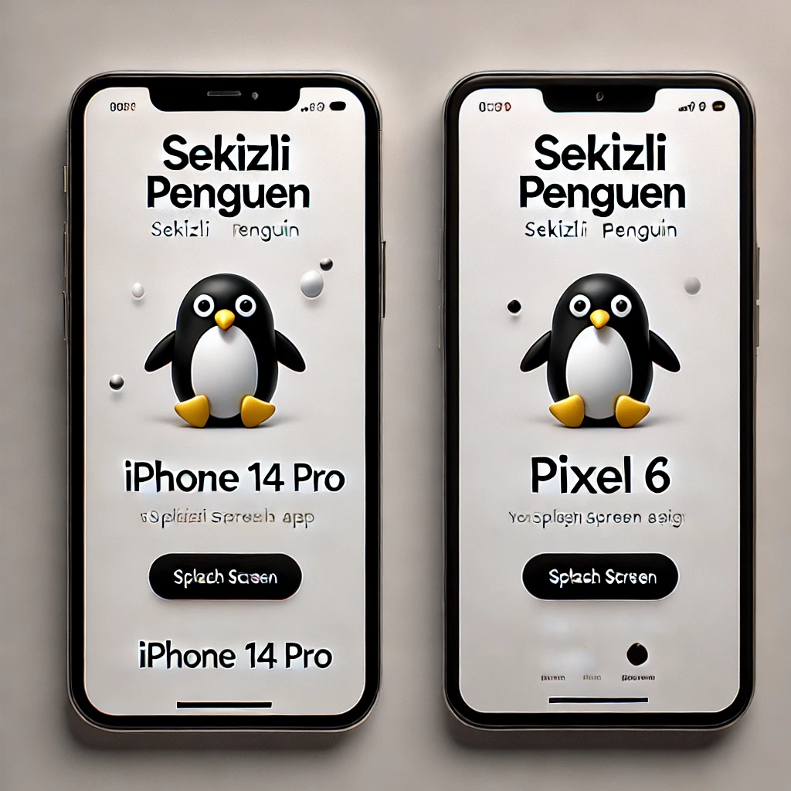

[](https://www.npmjs.com/package/@sekizlipenguen/react-native-splash-helper)
[](https://www.npmjs.com/package/@sekizlipenguen/react-native-splash-helper)


# @sekizlipenguen/react-native-splash-helper

A lightweight React Native library to automatically configure splash screens for both Android and iOS platforms. Simplifies the splash screen setup process for developers.

## Features

- **Automatic Splash Screen Setup**: Configures splash screens for both Android and iOS with minimal setup.
- **Theme Detection**: Automatically detects application and activity themes in `AndroidManifest.xml`.
- **Cross-Platform Support**: Works seamlessly on macOS, Linux, and Windows.
- **Customizable**: Easily define splash image and background color through a simple configuration.

---

## Installation

Install the library using Yarn or npm:

YARN
```bash
yarn add @sekizlipenguen/react-native-splash-helper --dev
```
NPM
```bash
npm install @sekizlipenguen/react-native-splash-helper --save-dev
```


> Note: The `xml2js` package is included as a dependency and used internally.

---

## Configuration

### Configuration Options

| Option                  | Platform | Type     | Description                                                            |
|-------------------------|----------|----------|------------------------------------------------------------------------|
| `splashImage`           | Both     | `string` | Path to the splash image file.                                         |
| `backgroundColor`       | Android  | `string` | Background color in HEX format (e.g., `#ffffff`).                      |

To configure the splash helper, add a section to your `react-native.config.js` file:

```javascript
module.exports = {
  dependencies: {},
  '@sekizlipenguen/react-native-splash-helper': {
    android: {
      splashImage: './assets/splash_image.png' // Path to your splash image
    },
    ios: {
      splashImage: './assets/splash_image.png'  // Path to your splash image
    }
  }
};
```

---

## Usage

Run the following command to generate the splash screens:

```bash
npx @sekizlipenguen/react-native-splash-helper generate-splash
```

---

## What It Does

1. **Android**:

    - Updates `styles.xml` to include the `android:windowBackground` property for detected themes.
    - Updates or creates `colors.xml` with the specified background color.
    - Generates the drawable resource for the splash screen.
    - Updates the `AndroidManifest.xml` to ensure consistency in theme configuration.

2. **iOS**:

    - Updates the `LaunchScreen.storyboard` file with the splash image and background color.
    - Creates the necessary image assets in the `Images.xcassets` directory.

---

## Example

### Android Output

- Updates the following in `styles.xml`:
  ```xml
  <style name="AppTheme" parent="Theme.AppCompat.DayNight.NoActionBar">
      <item name="android:windowBackground">@drawable/splash_background</item>
  </style>
  ```
- Updates or creates `colors.xml`:
  ```xml
  <resources>
      <color name="splash_background">#ffffff</color>
  </resources>
  ```
- Creates `splash_background.xml` in `drawable`:
  ```xml
  <layer-list xmlns:android="http://schemas.android.com/apk/res/android">
      <item android:drawable="@color/splash_background" />
      <item>
          <bitmap android:gravity="fill" android:src="@drawable/splash_image" />
      </item>
  </layer-list>
  ```

### iOS Output

- Updates `LaunchScreen.storyboard` with:
  ```xml
  <document type="com.apple.InterfaceBuilder3.CocoaTouch.Storyboard.XIB" ...>
      <scene>
          ...
          <view key="view" contentMode="scaleToFill">
              <color key="backgroundColor" systemColor="systemBackgroundColor" />
              <subviews>
                  <imageView contentMode="scaleAspectFill" image="splash_image" ... />
              </subviews>
          </view>
      </scene>
  </document>
  ```

---

## Screenshots

###  Splash Screen Example

---

## Notes

- Make sure your splash image is available at the specified path.
- If any required file (e.g., `styles.xml`, `colors.xml`) does not exist, it will be created automatically.
- The script is non-destructive and will not overwrite existing configurations unless necessary.

---

## Contributing

Contributions are welcome! Please submit an issue or pull request on the [GitHub repository](https://github.com/sekizlipenguen/react-native-splash-helper).

---

## License

MIT © [Sekizli Penguen](https://github.com/sekizlipenguen)

